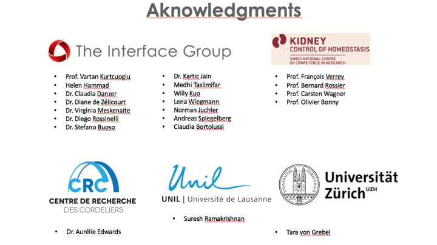

# WebApp_CaP_homeostasis
Repository of NCCR project containing shiny apps of Calcium Phosphate homeostasis

### **Staff** ###
+ *Project manager*: [Dr. Diane de Zélicourt and Prof. Vartan Kurtcuoglu](http://interfacegroup.ch/people/)
+ *Experts in Physiology*: 
  - [Prof. François Verrey](https://www.physiol.uzh.ch/en/research/institutegroups/EpithelialTransports/TeamMembers/FVerrey.html),
  - [Prof. Olivier Bonny](https://www.unil.ch/dpt/fr/home/menuinst/recherche/groupe-bonny.html),
  - [Prof. Bernard Rossier](https://hset.org/organization/team/),
  - [Prof. Carten Wagner](https://www.physiol.uzh.ch/en/research/institutegroups/Acidbasetransport/Grwagner/CWagner.html)
+ *Graphic designer*: [Tara von Grebel](https://www.uzh.ch/id/cl/iframe/org/index.php?id=tg)
+ *Model developer*: [Dr. David Granjon](https://divadnojnarg.github.io)
+ *Web/R developer*: Dr. David Granjon
+ *Server management*: Dr. David Granjon
+ *Server expert*: [Dr. Sergio Maffioletti](https://www.id.uzh.ch/en/scienceit/about/team.html)
+ *Consultants*: [Dr. Nathalie Debard](https://hset.org/organization/team/)

### **Aknowledgments** ###




I am also very grateful to the [Shiny](http://shiny.rstudio.com) developers 
and [RStudio](https://www.rstudio.com) team, who provide a lot of useful softwares
and packages. 

I finally thanks: Dean Attali ([shinyjs](https://deanattali.com/shinyjs/)), 
Karline Soetaert and Thomas Petzoldt ([deSolve](http://desolve.r-forge.r-project.org)),
Carson Sievert ([plotly](https://plot.ly/r/)), 
the datastorm team ([visNetwork](http://datastorm-open.github.io/visNetwork/)),
the dream R team ([shinyWidgets](https://dreamrs.github.io/shinyWidgets/index.html)),
Hadley Wickham and the Tidyverse team ([purrr and stringr](https://www.tidyverse.org/packages/)),
Eric Bailey ([shinyMenus and shinyBS](https://github.com/ebailey78)),
Andrew Sali ([shinycssloaders](https://github.com/andrewsali/shinycssloaders)),
Yang Tang ([shinyjqui](https://cran.r-project.org/web/packages/shinyjqui/vignettes/introduction.html)),
Ian Lyttle ([bsplus](http://ijlyttle.github.io/bsplus/)),
Kent Russell ([sweetalertR](http://timelyportfolio.github.io/buildingwidgets/week25/sweetalert_examples.html)),
Carl Ganz and Afshin Mehrabani ([rintrojs](https://carlganz.github.io/rintrojs/)),
Andy Merlino ([shinyFeedback](https://cran.r-project.org/web/packages/shinyFeedback/vignettes/shinyFeedback-intro.html))

```R
library(shiny)
library(plotly)
library(deSolve)
require(visNetwork)
library(shinyBS)
library(shinydashboard)
library(shinythemes)
library(shinyjs)
library(shinycssloaders)
library(shinyWidgets)
library(shinyjqui)
library(bsplus)
library(sweetalertR)
library(rintrojs)
library(purrr)
library(stringr)
library(shinyMenus)
library(shinyFeedback)
```

### **Contacts** ###

*david.granjon_at_uzh.ch*
(see the changelog file to access all versions)

## Changelog version 2.5 (global app)
- add human background
- adapt node display to the human background
- relabel PTH, D3, FGF23, PO4 and Ca nodes to concentrations
- fix the PTH blurred image problem
- add 4 parathyroid glands for human
- add an about section in the navbar
- rewrite some parts of the compiled C core (variable definitions)


## Changelog version 2.3 (case studies app)
- adapt node display to the human background
- relabel PTH, D3, FGF23, PO4 and Ca nodes to concentrations
- fix the PTH blurred image problem
- add 4 parathyroid glands for human
- delete biological data from plots
- rename sliders for case studies
- add an about section in the navbar
- reorganize the navbar, new sections: basis and case studies
- basis section will contain futur animations (UZH design department)
- add a new method to read files stored in www folder

# **To do** list

## General

- set a load balancer (Ready to be done)
- set authentication
- <del>use a compiled model instead of only deSolve core<del> (DONE)
- write "about" section for the staff
- update the main website
- refine video tutorials
- make animations on visnetwork (blinking,...)


## Global App

- improve the navigation between detailed zoom in the main app
- find another place to put the active slider(s), maybe in the navbar
so that they are always visible.
- table of modified parameters to remind the user what is changed or not.
- the size of the box should scale each screen (and file the whole half page, 
which is not the case now).
- decrease navbar height.
- improve help navigation.
- adjust the human background.

## Case studies App

- check plot scaling when screen size is reduced.
- the size of the box should scale each screen (and file the whole half page, 
which is not the case now).
- adjust the human background.
- slider cursor on 1 by default for each simulation (need to set a reset).
- find a way to better user graphs.
- include detailed zoom?
- change title "steady-state" and "dynamics" simulations (too computational).
- use "explanations"" instead of "notifications".
